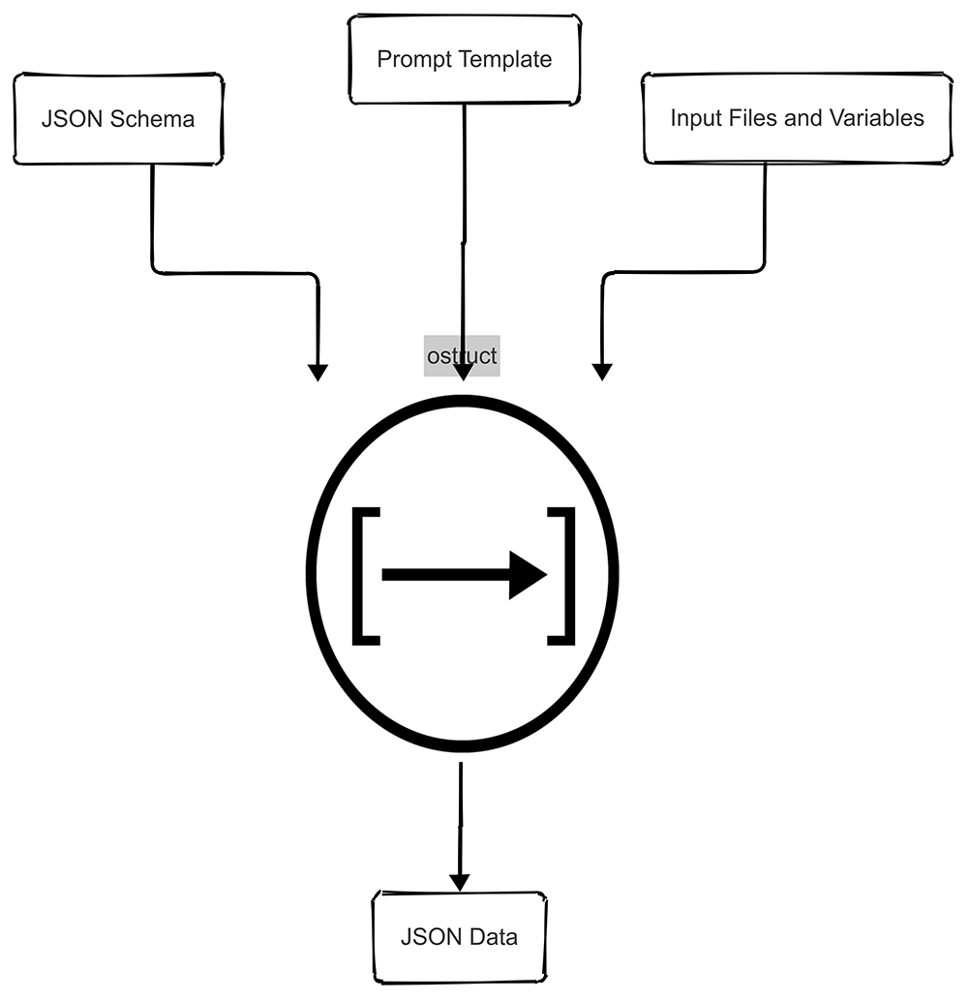

## 02:07 A.M. CI Failure

*"Build failed. Again. The third time this week our data extraction pipeline broke because someone changed the log format, and our regex-based parser couldn't handle the new structure. Sarah's on vacation, Mike's parsing code is unreadable, and the client wants their analytics dashboard working by morning.*

*There has to be a better way to turn messy data into structured JSON without writing custom parsers for every format change..."*

---


<div align="center">

[](https://badge.fury.io/py/ostruct-cli)
[](https://pypi.org/project/ostruct-cli)
[](https://ostruct.readthedocs.io/en/latest/?badge=latest)
[](https://github.com/yaniv-golan/ostruct/actions/workflows/ci.yml)
[](https://opensource.org/licenses/MIT)
[](https://pepy.tech/project/ostruct-cli)
[](https://github.com/psf/black)

**ostruct** transforms **unstructured** inputs into **structured**, usable **JSON** output using **OpenAI APIs** with **multi-tool integration**

*The better way you've been looking for.*

</div>

# ostruct-cli

ostruct processes unstructured data (text files, code, CSVs, etc.), input variables, and dynamic prompt templates to produce structured JSON output defined by a JSON schema. With enhanced multi-tool integration, ostruct now supports Code Interpreter for data analysis, File Search for document retrieval, and MCP (Model Context Protocol) servers for extended capabilities.

<div align="center">



</div>

## Why ostruct?

LLMs are powerful, but getting consistent, structured output from them can be challenging. ostruct solves this problem by providing a streamlined approach to transform unstructured data into reliable JSON structures. The motivation behind creating ostruct was to:

- **Bridge the gap** between freeform LLM capabilities and structured data needs in production systems
- **Simplify integration** of AI into existing workflows and applications that expect consistent data formats
- **Ensure reliability** and validate output against a defined schema to avoid unexpected formats or missing data
- **Reduce development time** by providing a standardized way to interact with OpenAI models for structured outputs
- **Enable non-developers** to leverage AI capabilities through a simple CLI interface with templates

## Real-World Use Cases

ostruct can be used for various scenarios, including:

### Automated Code Review with Multi-Tool Analysis

```bash
# Traditional pattern matching
ostruct run prompts/task.j2 schemas/code_review.json -p source "examples/security/*.py"

# Enhanced with Code Interpreter for deeper analysis
ostruct run prompts/task.j2 schemas/code_review.json -fc examples/security/ -fs documentation/
```

Analyze code for security vulnerabilities, style issues, and performance problems. The enhanced version uses Code Interpreter for execution analysis and File Search for documentation context.

### Security Vulnerability Scanning

```bash
# Budget-friendly static analysis (recommended for most projects)
ostruct run prompts/static_analysis.j2 schemas/scan_result.json \
  -d code examples -R --sys-file prompts/system.txt

# Professional security analysis with Code Interpreter (best balance)
ostruct run prompts/code_interpreter.j2 schemas/scan_result.json \
  -dc examples --sys-file prompts/system.txt

# Comprehensive hybrid analysis for critical applications
ostruct run prompts/hybrid_analysis.j2 schemas/scan_result.json \
  -d code examples -R -dc examples --sys-file prompts/system.txt
```

**Three optimized approaches** for automated security vulnerability scanning:

- **Static Analysis**: $0.18 cost, fast processing, comprehensive vulnerability detection
- **Code Interpreter**: $0.18 cost (same!), superior analysis quality with evidence-based findings
- **Hybrid Analysis**: $0.20 cost (+13%), maximum depth with cross-validation

Each approach finds the same core vulnerabilities but with different levels of detail and analysis quality. Directory-based analysis provides comprehensive project coverage in a single scan.

### Data Analysis with Code Interpreter

```bash
# Upload data for analysis and visualization
ostruct run analysis.j2 schemas/analysis_result.json \
  -fc sales_data.csv -fc customer_data.json \
  -fs reports/ -ft config.yaml
```

Perform sophisticated data analysis using Python execution, generate visualizations, and create comprehensive reports with document context.

### Configuration Validation & Analysis

```bash
# Traditional file comparison
ostruct run prompts/task.j2 schemas/validation_result.json \
  -f dev examples/basic/dev.yaml -f prod examples/basic/prod.yaml

# Enhanced with environment context
ostruct run prompts/task.j2 schemas/validation_result.json \
  -ft dev.yaml -ft prod.yaml -fs infrastructure_docs/
```

Validate configuration files across environments with documentation context for better analysis and recommendations.

Oh, and also, among endless other use cases:

### Etymology Analysis

```bash
ostruct run prompts/task.j2 schemas/etymology.json -ft examples/scientific.txt
```

Break down words into their components, showing their origins, meanings, and hierarchical relationships. Useful for linguistics, educational tools, and understanding terminology in specialized fields.

## Features

### Core Capabilities

- Generate structured JSON output defined by dynamic prompts using OpenAI models and JSON schemas
- Rich template system for defining prompts (Jinja2-based)
- Automatic token counting and context window management
- Streaming support for real-time output
- Secure handling of sensitive data with comprehensive path validation
- Automatic prompt optimization and token management

### Multi-Tool Integration

- **Code Interpreter**: Upload and analyze data files, execute Python code, generate visualizations
- **File Search**: Vector-based document search and retrieval from uploaded files
- **MCP Servers**: Connect to Model Context Protocol servers for extended functionality
- **Explicit File Routing**: Route different files to specific tools for optimized processing

### Advanced Features

- **Configuration System**: YAML-based configuration with environment variable support
- **Unattended Operation**: Designed for CI/CD and automation scenarios
- **Progress Reporting**: Real-time progress updates with clear, user-friendly messaging
- **Model Registry**: Dynamic model management with support for latest OpenAI models

## Requirements

- Python 3.10 or higher

## Installation

### For Users

To install the latest stable version from PyPI:

```bash
pip install ostruct-cli
```

### For Developers

If you plan to contribute to the project, see the [Development Setup](#development-setup) section below for instructions on setting up the development environment with Poetry.

## Environment Variables

ostruct-cli respects the following environment variables:

- `OPENAI_API_KEY`: Your OpenAI API key (required unless provided via command line)
- `OPENAI_API_BASE`: Custom API base URL (optional)
- `OPENAI_API_VERSION`: API version to use (optional)
- `OPENAI_API_TYPE`: API type (e.g., "azure") (optional)
- `OSTRUCT_DISABLE_REGISTRY_UPDATE_CHECKS`: Set to "1", "true", or "yes" to disable automatic registry update checks
- `MCP_<NAME>_URL`: Custom MCP server URLs (e.g., `MCP_STRIPE_URL=https://mcp.stripe.com`)

<details>
<summary><strong>Shell Completion Setup</strong> (Click to expand)</summary>

ostruct-cli supports shell completion for Bash, Zsh, and Fish shells. To enable it:

### Bash

Add this to your `~/.bashrc`:

```bash
eval "$(_OSTRUCT_COMPLETE=bash_source ostruct)"
```

### Zsh

Add this to your `~/.zshrc`:

```bash
eval "$(_OSTRUCT_COMPLETE=zsh_source ostruct)"
```

### Fish

Add this to your `~/.config/fish/completions/ostruct.fish`:

```fish
eval (env _OSTRUCT_COMPLETE=fish_source ostruct)
```

After adding the appropriate line, restart your shell or source the configuration file.
Shell completion will help you with:

- Command options and their arguments
- File paths for template and schema files
- Directory paths for `-d` and `--base-dir` options
- And more!

</details>

## Enhanced CLI with Multi-Tool Integration

### Migration Notice

ostruct now includes powerful multi-tool integration while maintaining **full backward compatibility**. All existing commands continue to work exactly as before, but you can now take advantage of:

- **Code Interpreter** for data analysis and visualization
- **File Search** for document retrieval
- **MCP Servers** for extended functionality
- **Explicit File Routing** for optimized processing

<details>
<summary><strong>New File Routing Options</strong> (Click to expand)</summary>

#### Basic File Routing (Explicit Tool Assignment)

```bash
# Template access only (config files, small data)
ostruct run template.j2 schema.json -ft config.yaml

# Code Interpreter (data analysis, code execution)
ostruct run analysis.j2 schema.json -fc data.csv

# File Search (document retrieval)
ostruct run search.j2 schema.json -fs documentation.pdf

# Multiple tools with one file
ostruct run template.j2 schema.json --file-for code-interpreter shared.json --file-for file-search shared.json
```

#### Directory Routing

ostruct provides two directory routing patterns to match different use cases:

**Auto-Naming Pattern** (for known directory structures):

```bash
# Variables are auto-generated from directory contents
ostruct run template.j2 schema.json -dt ./config -dc ./datasets -ds ./docs
# Creates variables like: config_yaml, datasets_csv, docs_pdf (based on actual files)
```

**Alias Pattern** (for generic, reusable templates):

```bash
# Create stable variable names regardless of directory contents
ostruct run template.j2 schema.json --dta app_config ./config --dca data ./datasets --dsa knowledge ./docs
# Creates stable variables: app_config, data, knowledge (always these names)
```

**When to Use Each Pattern:**

- Use **auto-naming** (`-dt`, `-dc`, `-ds`) when your template knows the specific directory structure
- Use **alias syntax** (`--dta`, `--dca`, `--dsa`) when your template is generic and needs stable variable names

**Template Example:**

```jinja
{# Works with alias pattern - variables are predictable #}

Configuration: {{ file.name }} = {{ file.content }}


{# Analysis data from stable variable name #}

Processing: {{ file.path }}

```

This design pattern makes templates reusable across different projects while maintaining full backward compatibility.

#### MCP Server Integration

```bash
# Connect to MCP servers for extended capabilities
ostruct run template.j2 schema.json --mcp-server deepwiki@https://mcp.deepwiki.com/sse
```

</details>

### Configuration System

Create an `ostruct.yaml` file for persistent settings:

```yaml
models:
  default: gpt-4o

tools:
  code_interpreter:
    auto_download: true
    output_directory: "./output"

mcp:
  custom_server: "https://my-mcp-server.com"

limits:
  max_cost_per_run: 10.00
```

Load custom configuration:

```bash
ostruct --config my-config.yaml run template.j2 schema.json
```

## Get Started Quickly

🚀 **New to ostruct?** Follow our [step-by-step quickstart guide](https://ostruct.readthedocs.io/en/latest/user-guide/quickstart.html) featuring Juno the beagle for a hands-on introduction.

📖 **Full Documentation:** <https://ostruct.readthedocs.io/>

### Quick Start

1. Set your OpenAI API key:

```bash
export OPENAI_API_KEY=your-api-key
```

### Example 1: Basic Text Extraction (Simplest)

1. Create a template file `extract_person.j2`:

```jinja
Extract information about the person from this text: {{ stdin }}
```

2. Create a schema file `schema.json`:

```json
{
  "type": "object",
  "properties": {
    "person": {
      "type": "object",
      "properties": {
        "name": {"type": "string", "description": "The person's full name"},
        "age": {"type": "integer", "description": "The person's age"},
        "occupation": {"type": "string", "description": "The person's job"}
      },
      "required": ["name", "age", "occupation"],
      "additionalProperties": false
    }
  },
  "required": ["person"],
  "additionalProperties": false
}
```

3. Run the CLI:

```bash
# Basic usage
echo "John Smith is a 35-year-old software engineer" | ostruct run extract_person.j2 schema.json

# With enhanced options
echo "John Smith is a 35-year-old software engineer" | \
  ostruct run extract_person.j2 schema.json \
  --model gpt-4o \
  --temperature 0.7
```

### Example 2: Multi-Tool Data Analysis

1. Create an analysis template `analysis_template.j2`:

```jinja
Analyze the following data sources:


Sales Data: {{ sales_data_csv.name }} ({{ sales_data_csv.size }} bytes)



Customer Data: {{ customer_data_json.name }} ({{ customer_data_json.size }} bytes)



Market Reports: {{ market_reports_pdf.name }} ({{ market_reports_pdf.size }} bytes)



Configuration: {{ config_yaml.content }}


Provide comprehensive analysis and actionable insights.
```

2. Create an analysis schema `analysis_schema.json`:

```json
{
  "type": "object",
  "properties": {
    "analysis": {
      "type": "object",
      "properties": {
        "insights": {"type": "string", "description": "Key insights from the data"},
        "recommendations": {
          "type": "array",
          "items": {"type": "string"},
          "description": "Actionable recommendations"
        },
        "data_quality": {"type": "string", "description": "Assessment of data quality"}
      },
      "required": ["insights", "recommendations"],
      "additionalProperties": false
    }
  },
  "required": ["analysis"],
  "additionalProperties": false
}
```

3. For more complex scenarios, use explicit file routing with flexible syntax options:

```bash
# Auto-naming (fastest for one-off analysis)
ostruct run analysis_template.j2 analysis_schema.json \
  -fc sales_data.csv \
  -fc customer_data.json \
  -fs market_reports.pdf \
  -ft config.yaml

# Mixed syntax with custom variable names
ostruct run analysis_template.j2 analysis_schema.json \
  -fc sales_data.csv \
  -fc customers customer_data.json \
  --fsa reports market_reports.pdf \
  --fta app_config config.yaml

# Alias syntax for reusable templates (best tab completion)
ostruct run reusable_analysis.j2 analysis_schema.json \
  --fca sales_data sales_data.csv \
  --fca customer_data customer_data.json \
  --fsa market_reports market_reports.pdf \
  --fta config config.yaml

# Code review with stable variable names
ostruct run code_review.j2 review_schema.json \
  --fca source_code source_code/ \
  --fsa documentation docs/ \
  --fta eslint_config .eslintrc.json
```

### Example 3: Legacy Compatibility

All existing commands continue to work unchanged:

```bash
# Traditional usage (fully supported)
ostruct run extract_from_file.j2 schema.json -f text input.txt -d configs
ostruct run template.j2 schema.json -p "*.py" source -V env=prod
```

<details>
<summary><strong>System Prompt Handling</strong> (Click to expand)</summary>

ostruct-cli provides three ways to specify a system prompt, with a clear precedence order:

1. Command-line option (`--sys-prompt` or `--sys-file`):

   ```bash
   # Direct string
   ostruct run template.j2 schema.json --sys-prompt "You are an expert analyst"

   # From file
   ostruct run template.j2 schema.json --sys-file system_prompt.txt
   ```

2. Template frontmatter:

   ```jinja
   ---
   system_prompt: You are an expert analyst
   ---
   Extract information from: {{ text }}
   ```

3. Shared system prompts (with template frontmatter):

   ```jinja
   ---
   include_system: shared/base_analyst.txt
   system_prompt: Focus on financial metrics
   ---
   Extract information from: {{ text }}
   ```

4. Default system prompt (built into the CLI)

### Precedence Rules

When multiple system prompts are provided, they are resolved in this order:

1. Command-line options take highest precedence:
   - If both `--sys-prompt` and `--sys-file` are provided, `--sys-prompt` wins
   - Use `--ignore-task-sysprompt` to ignore template frontmatter

2. Template frontmatter is used if:
   - No command-line options are provided
   - `--ignore-task-sysprompt` is not set

3. Default system prompt is used only if no other prompts are provided

Example combining multiple sources:

```bash
# Command-line prompt will override template frontmatter
ostruct run template.j2 schema.json --sys-prompt "Override prompt"

# Ignore template frontmatter and use default
ostruct run template.j2 schema.json --ignore-task-sysprompt
```

</details>

## Model Registry Management

ostruct-cli maintains a registry of OpenAI models and their capabilities, which includes:

- Context window sizes for each model
- Maximum output token limits
- Supported parameters and their constraints
- Model version information

To ensure you're using the latest models and features, you can update the registry:

```bash
# Update from the official repository
ostruct update-registry

# Update from a custom URL
ostruct update-registry --url https://example.com/models.yml

# Force an update even if the registry is current
ostruct update-registry --force
```

This is especially useful when:

- New OpenAI models are released
- Model capabilities or parameters change
- You need to work with custom model configurations

The registry file is stored at `~/.openai_structured/config/models.yml` and is automatically referenced when validating model parameters and token limits.

The update command uses HTTP conditional requests (If-Modified-Since headers) to check if the remote registry has changed before downloading, ensuring efficient updates.

<!--
MAINTAINER NOTE: After editing this README, please test GitHub rendering by:
1. Creating a draft PR or pushing to a test branch
2. Verifying all HTML <details> sections expand/collapse correctly
3. Checking badge display and links work as expected
4. Ensuring quickstart guide link is functional
-->
