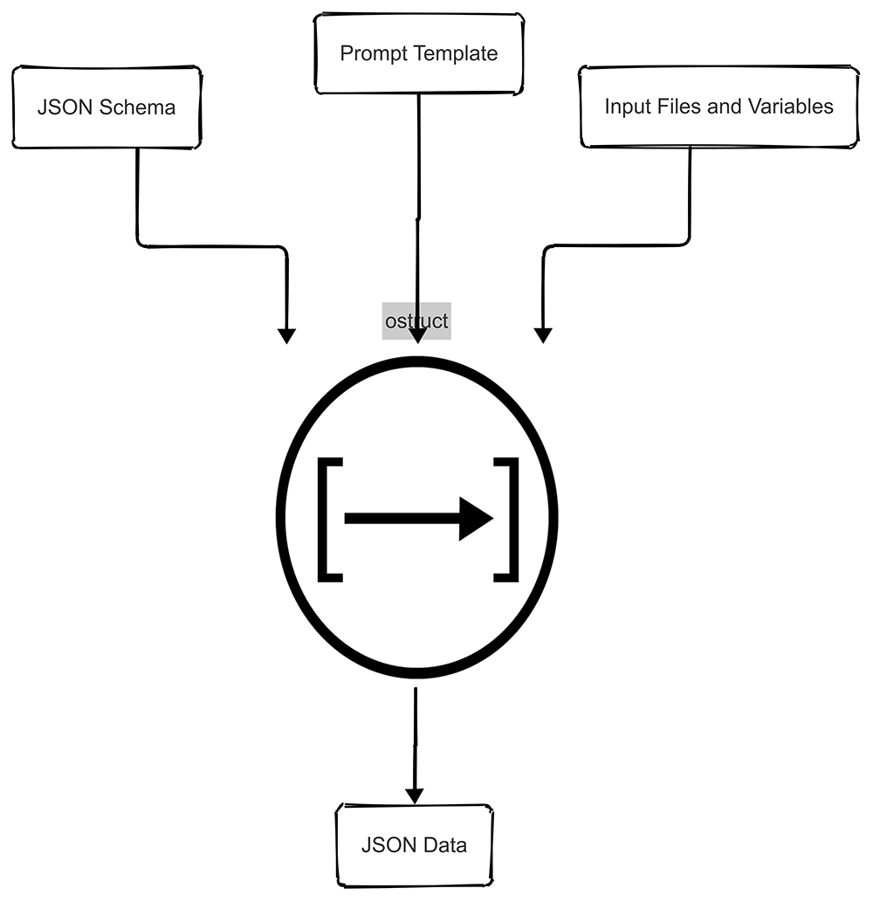

## 02:07 A.M. CI Failure

*"Build failed. Again. The third time this week our data extraction pipeline broke because someone changed the log format, and our regex-based parser couldn't handle the new structure. Sarah's on vacation, Mike's parsing code is unreadable, and the client wants their analytics dashboard working by morning.*

*There has to be a better way to turn messy data into structured JSON without writing custom parsers for every format change..."*

---


<div align="center">

[](https://badge.fury.io/py/ostruct-cli)
[](https://pypi.org/project/ostruct-cli)
[](https://ostruct.readthedocs.io/en/latest/?badge=latest)
[](https://github.com/yaniv-golan/ostruct/actions/workflows/ci.yml)
[](https://opensource.org/licenses/MIT)
[](https://pepy.tech/project/ostruct-cli)
[](https://github.com/psf/black)

**ostruct** transforms **unstructured** inputs into **structured**, usable **JSON** output using **OpenAI APIs** with **multi-tool integration**

*The better way you've been looking for.*

</div>

# ostruct-cli

ostruct processes unstructured data (text files, code, CSVs, etc.), input variables, and dynamic prompt templates to produce structured JSON output defined by a JSON schema. With enhanced multi-tool integration, ostruct now supports Code Interpreter for data analysis, File Search for document retrieval, Web Search for real-time information access, and MCP (Model Context Protocol) servers for extended capabilities.

<div align="center">



</div>

## Why ostruct?

LLMs are powerful, but getting consistent, structured output from them can be challenging. ostruct solves this problem by providing a streamlined approach to transform unstructured data into reliable JSON structures. The motivation behind creating ostruct was to:

- **Bridge the gap** between freeform LLM capabilities and structured data needs in production systems
- **Simplify integration** of AI into existing workflows and applications that expect consistent data formats
- **Ensure reliability** and validate output against a defined schema to avoid unexpected formats or missing data
- **Reduce development time** by providing a standardized way to interact with OpenAI models for structured outputs
- **Enable non-developers** to leverage AI capabilities through a simple CLI interface with templates

## Real-World Use Cases

ostruct can be used for various scenarios, including:

### Automated Code Review with Multi-Tool Analysis

```bash
# Template-only analysis (fast, cost-effective)
ostruct run prompts/task.j2 schemas/code_review.json --collect source @file-list.txt

# Enhanced with Code Interpreter for deeper analysis
ostruct run prompts/task.j2 schemas/code_review.json --file ci:code examples/security/ --file fs:docs documentation/
```

Analyze code for security vulnerabilities, style issues, and performance problems. The enhanced version uses Code Interpreter for execution analysis and File Search for documentation context.

### Security Vulnerability Scanning

```bash
# Budget-friendly static analysis (recommended for most projects)
ostruct run prompts/static_analysis.j2 schemas/scan_result.json \
  --dir code examples --pattern "*.py" --sys-file prompts/system.txt

# Professional security analysis with Code Interpreter (best balance)
ostruct run prompts/code_interpreter.j2 schemas/scan_result.json \
  --dir ci:code examples --sys-file prompts/system.txt

# Comprehensive hybrid analysis for critical applications
ostruct run prompts/hybrid_analysis.j2 schemas/scan_result.json \
  --dir code examples --dir ci:analysis examples --sys-file prompts/system.txt
```

**Three optimized approaches** for automated security vulnerability scanning:

- **Static Analysis**: $0.18 cost, fast processing, comprehensive vulnerability detection
- **Code Interpreter**: $0.18 cost (same!), superior analysis quality with evidence-based findings
- **Hybrid Analysis**: $0.20 cost (+13%), maximum depth with cross-validation

Each approach finds the same core vulnerabilities but with different levels of detail and analysis quality. Directory-based analysis provides comprehensive project coverage in a single scan, automatically excluding build artifacts and sensitive files via .gitignore patterns.

### Data Analysis with Code Interpreter

```bash
# Upload data for analysis and visualization
ostruct run analysis.j2 schemas/analysis_result.json \
  --file ci:sales sales_data.csv --file ci:customers customer_data.json \
  --dir fs:reports reports/ --file config config.yaml
```

Perform sophisticated data analysis using Python execution, generate visualizations, and create comprehensive reports with document context.

### Configuration Validation & Analysis

```bash
# Traditional file comparison
ostruct run prompts/task.j2 schemas/validation_result.json \
  --file dev examples/basic/dev.yaml --file prod examples/basic/prod.yaml

# Enhanced with environment context
ostruct run prompts/task.j2 schemas/validation_result.json \
  --file dev dev.yaml --file prod prod.yaml --dir fs:docs infrastructure_docs/
```

Validate configuration files across environments with documentation context for better analysis and recommendations.

Oh, and also, among endless other use cases:

### Etymology Analysis

```bash
ostruct run prompts/task.j2 schemas/etymology.json --file text examples/scientific.txt
```

Break down words into their components, showing their origins, meanings, and hierarchical relationships. Useful for linguistics, educational tools, and understanding terminology in specialized fields.

### Optional File References

```bash
# Attach files with aliases
ostruct run template.j2 schema.json \
  --dir source-code src/ \
  --file config config.yaml
```

**Two ways to access files in templates:**

```jinja2
{# Option 1: Automatic XML appendix (optional) #}
Analyze {{ file_ref("source-code") }} and {{ file_ref("config") }}.

{# Option 2: Manual formatting (full control) #}
## Source Code

### {{ file.name }}
```{{ file.name.split('.')[-1] }}
{{ file.content }}
```



```

The optional `file_ref()` function provides clean references with automatic XML appendix generation. Alternatively, access files directly for custom formatting and placement control. Perfect for code reviews, documentation analysis, and multi-file processing workflows.

## Features

### Core Capabilities

- Generate structured JSON output defined by dynamic prompts using OpenAI models and JSON schemas
- Rich template system for defining prompts (Jinja2-based)
- Automatic token counting and context window management
- Streaming support for real-time output
- Secure handling of sensitive data with comprehensive path validation
- Automatic prompt optimization and token management

### Multi-Tool Integration

- **Code Interpreter**: Upload and analyze data files, execute Python code, generate visualizations
- **File Search**: Vector-based document search and retrieval from uploaded files
- **Web Search**: Real-time information retrieval and current data access via OpenAI's web search tool
- **MCP Servers**: Connect to Model Context Protocol servers for extended functionality
- **Explicit Tool Targeting**: Route files to specific tools (prompt, code-interpreter, file-search) with precise control

### Advanced Features

- **Configuration System**: YAML-based configuration with environment variable support
- **Gitignore Support**: Automatic .gitignore pattern matching for clean directory file collection
- **Unattended Operation**: Designed for CI/CD and automation scenarios
- **Progress Reporting**: Real-time progress updates with clear, user-friendly messaging
- **Model Registry**: Dynamic model management with support for latest OpenAI models
- **Optional File References**: Clean `file_ref()` function for automatic XML appendix, or direct file access for custom formatting

## Requirements

- Python 3.10 or higher

## Installation

We provide multiple installation methods to suit different user needs. Choose the one that's right for you.

<details>
<summary><strong>Recommended: pipx</strong></summary>

`pipx` is the recommended installation method. It installs `ostruct` in an isolated environment, preventing conflicts with other Python packages.

**macOS (with Homebrew):**
```bash
brew install pipx
pipx install ostruct-cli       # new users
pipx upgrade ostruct-cli       # existing users
```

**Linux (Ubuntu/Debian):**

```bash
sudo apt install pipx
pipx install ostruct-cli       # new users
pipx upgrade ostruct-cli       # existing users
```

**Other systems:**

```bash
python3 -m pip install --user pipx
python3 -m pipx ensurepath
# Restart your terminal
pipx install ostruct-cli
```

</details>

<details>
<summary><strong>macOS: Homebrew</strong></summary>

If you're on macOS and use Homebrew, you can install `ostruct` with a single command:

```bash
brew install yaniv-golan/ostruct/ostruct-cli
```

</details>

<details>
<summary><strong>Standalone Binaries (No Python Required)</strong></summary>

We provide pre-compiled .zip archives for macOS, Windows, and Linux that do not require Python to be installed.

1. Go to the [**Latest Release**](https://github.com/yaniv-golan/ostruct/releases/latest) page.
2. Download the `.zip` file for your operating system (e.g., `ostruct-macos-latest.zip`, `ostruct-windows-latest.zip`, `ostruct-ubuntu-latest.zip`).
3. Extract the `.zip` file. This will create a folder (e.g., `ostruct-macos-amd64`).
4. On macOS/Linux, make the executable inside the extracted folder runnable:

    ```bash
    chmod +x /path/to/ostruct-macos-amd64/ostruct
    ```

5. Run the executable from within the extracted folder, as it depends on bundled libraries in the same directory.

</details>

<details>
<summary><strong>Docker</strong></summary>

If you prefer to use Docker, you can run `ostruct` from our official container image available on the GitHub Container Registry.

```bash
docker run -it --rm \
  -v "$(pwd)":/app \
  -w /app \
  ghcr.io/yaniv-golan/ostruct:latest \
  run template.j2 schema.json --file config input.txt
```

This command mounts the current directory into the container and runs `ostruct`.

</details>

### Uninstallation

To uninstall `ostruct`, use the method corresponding to how you installed it:

- **pipx**: `pipx uninstall ostruct-cli`
- **Homebrew**: `brew uninstall ostruct-cli`
- **Binaries**: Simply delete the binary file.
- **Docker**: No uninstallation is needed for the image itself, but you can remove it with `docker rmi ghcr.io/yaniv-golan/ostruct:latest`.

### Manual Installation

#### For Users

To install the latest stable version from PyPI:

```bash
pip install ostruct-cli
```

**Note**: If the `ostruct` command isn't found after installation, you may need to add Python's user bin directory to your PATH. See the [troubleshooting guide](scripts/README.md#troubleshooting) for details.

#### For Developers

If you plan to contribute to the project, see the [Development Setup](#development-setup) section below for instructions on setting up the development environment with Poetry.

## Environment Variables

ostruct-cli respects the following environment variables:

**API Configuration:**

- `OPENAI_API_KEY`: Your OpenAI API key (required unless provided via command line)
- `OPENAI_API_BASE`: Custom API base URL (optional)
- `OPENAI_API_VERSION`: API version to use (optional)
- `OPENAI_API_TYPE`: API type (e.g., "azure") (optional)

**System Configuration:**

- `OSTRUCT_DISABLE_REGISTRY_UPDATE_CHECKS`: Set to "1", "true", or "yes" to disable automatic registry update checks
- `OSTRUCT_MCP_URL_<name>`: Custom MCP server URLs (e.g., `OSTRUCT_MCP_URL_stripe=https://mcp.stripe.com`)

**File Collection:**

- `OSTRUCT_IGNORE_GITIGNORE`: Set to "true" to ignore .gitignore files by default (default: "false")
- `OSTRUCT_GITIGNORE_FILE`: Default path to gitignore file (default: ".gitignore")

**Template Processing Limits (Template-only files via `--file alias path`):**

- `OSTRUCT_TEMPLATE_FILE_LIMIT`: Maximum individual file size for template access (default: 65536 bytes / 64KB)
- `OSTRUCT_TEMPLATE_TOTAL_LIMIT`: Maximum total file size for all template files (default: 1048576 bytes / 1MB)
- `OSTRUCT_TEMPLATE_PREVIEW_LIMIT`: Maximum characters shown in template debugging previews (default: 4096)

> **Note**: Template limits only apply to files accessed via `--file alias path` (template-only routing). Files routed to Code Interpreter (`--file ci:`) or File Search (`--file fs:`) are not subject to these limits.

**💡 Tip**: ostruct automatically loads `.env` files from the current directory. Environment variables take precedence over `.env` file values.

<details>
<summary><strong>Shell Completion Setup</strong> (Click to expand)</summary>

ostruct-cli supports shell completion for Bash, Zsh, and Fish shells. To enable it:

### Bash

Add this to your `~/.bashrc`:

```bash
eval "$(_OSTRUCT_COMPLETE=bash_source ostruct)"
```

### Zsh

Add this to your `~/.zshrc`:

```bash
eval "$(_OSTRUCT_COMPLETE=zsh_source ostruct)"
```

### Fish

Add this to your `~/.config/fish/completions/ostruct.fish`:

```fish
eval (env _OSTRUCT_COMPLETE=fish_source ostruct)
```

After adding the appropriate line, restart your shell or source the configuration file.
Shell completion will help you with:

- Command options and their arguments
- File paths for template and schema files
- Directory paths for `-d` and `--base-dir` options
- And more!

</details>

## Enhanced CLI with Multi-Tool Integration

### Breaking Changes in v0.9.0

**⚠️ Important:** ostruct v0.9.0 introduces breaking changes to the file attachment system. The legacy file routing syntax has been completely replaced with a new explicit target/alias attachment system.

**New capabilities in v0.9.0:**

- **Explicit Tool Targeting**: Direct control over which tools receive files
- **Enhanced Security**: Three-tier security modes with path validation
- **Improved Multi-Tool Integration**: Better file sharing between tools
- **JSON Help Output**: Programmatic access to command help
- **Migration Guide**: Automated migration scripts for bulk updates

<details>
<summary><strong>New Attachment System (v0.9.0)</strong> (Click to expand)</summary>

#### Basic File Attachments

```bash
# Template access only (default - no tool upload)
ostruct run template.j2 schema.json --file config config.yaml

# Code Interpreter (data analysis, code execution)
ostruct run analysis.j2 schema.json --file ci:data data.csv

# File Search (document retrieval)
ostruct run search.j2 schema.json --file fs:docs documentation.pdf

# Multi-tool attachment (share between tools)
ostruct run workflow.j2 schema.json --file ci,fs:shared data.json
```

#### Directory Attachments

```bash
# Template-only directory access
ostruct run template.j2 schema.json --dir config ./config

# Upload directory to Code Interpreter
ostruct run analysis.j2 schema.json --dir ci:datasets ./data

# Upload directory to File Search
ostruct run search.j2 schema.json --dir fs:knowledge ./docs

# Directory with file pattern filtering
ostruct run template.j2 schema.json --dir source ./src --pattern "*.py"
```

#### File Collections

```bash
# Process multiple files from list
ostruct run batch.j2 schema.json --collect files @file-list.txt

# Upload collection to Code Interpreter
ostruct run analyze.j2 schema.json --collect ci:data @datasets.txt
```

#### Tool Targeting

The new system uses explicit targets for precise control:

- **`prompt`** (default): Template access only, no upload
- **`code-interpreter`** or **`ci`**: Upload for Python execution and analysis
- **`file-search`** or **`fs`**: Upload to vector store for document search
- **Multi-target**: `ci,fs:alias` shares file between multiple tools

#### Development Best Practice: Always Use --dry-run

**Validate templates before execution** to catch errors early and save API costs:

```bash
# 1. Validate everything first (catches binary file issues, template errors)
ostruct run analysis.j2 schema.json --file ci:data report.xlsx --dry-run

# 2. If validation passes, run for real
ostruct run analysis.j2 schema.json --file ci:data report.xlsx
```

The `--dry-run` flag performs comprehensive validation including template rendering, catching issues like:

- Binary file content access errors
- Template syntax problems
- Missing template variables
- File accessibility issues

#### Security Modes

```bash
# Strict security with explicit allowlists
ostruct run template.j2 schema.json \
  --path-security strict \
  --allow /safe/directory \
  --allow-file /specific/file.txt \
  --file data input.txt
```

#### MCP Server Integration

```bash
# Connect to MCP servers for extended capabilities
ostruct run template.j2 schema.json --mcp-server deepwiki@https://mcp.deepwiki.com/sse
```

</details>

### Configuration System

Create an `ostruct.yaml` file for persistent settings:

```yaml
models:
  default: gpt-4o

tools:
  code_interpreter:
    auto_download: true
    output_directory: "./downloads"
    download_strategy: "two_pass_sentinel"  # Enable reliable file downloads

mcp:
  custom_server: "https://my-mcp-server.com"

limits:
  max_cost_per_run: 10.00
```

Load custom configuration:

```bash
ostruct --config my-config.yaml run template.j2 schema.json
```

### Model Validation

ostruct automatically validates model names against the OpenAI model registry. Only models that support structured output are available for selection, ensuring compatibility with JSON schema outputs.

```bash
# See all available models with details
ostruct list-models

# Models are validated at command time
ostruct run template.j2 schema.json --model invalid-model
# Error: Invalid model 'invalid-model'. Available models: gpt-4o, gpt-4o-mini, o1 (and 12 more).
#        Run 'ostruct list-models' to see all 15 available models.

# Shell completion works with model names
ostruct run template.j2 schema.json --model <TAB>
# Shows: gpt-4o  gpt-4o-mini  o1  o1-mini  o3-mini  ...
```

**Model Registry Updates:**

The model list is automatically updated when you run `ostruct update-registry`. If you encounter model validation errors, try updating your registry first:

```bash
# Update model registry
ostruct update-registry

# Check available models
ostruct list-models
```

**Migration from Free-form Model Names:**

If you have existing scripts with hardcoded model names, they will continue to work as long as the model names are valid. Common issues and solutions:

- **Typos**: `gpt4o` → `gpt-4o`
- **Old names**: `gpt-4-turbo` → `gpt-4o`
- **Custom names**: Use `ostruct list-models` to see what's available

### Code Interpreter File Downloads

**Important**: If you're using Code Interpreter with structured output (JSON schemas), you may need to enable the two-pass download strategy to ensure files are downloaded reliably.

#### Option 1: CLI Flags (Recommended for one-off usage)

```bash
# Enable reliable file downloads for this run
ostruct run template.j2 schema.json --file ci:data data.csv --enable-feature ci-download-hack

# Force single-pass mode (override config)
ostruct run template.j2 schema.json --file ci:data data.csv --disable-feature ci-download-hack

# Handle duplicate output file names
ostruct run template.j2 schema.json --file ci:data data.csv --ci-duplicate-outputs rename
ostruct run template.j2 schema.json --file ci:data data.csv --ci-duplicate-outputs skip
```

#### Option 2: Configuration File (Recommended for persistent settings)

```yaml
# ostruct.yaml
tools:
  code_interpreter:
    download_strategy: "two_pass_sentinel"  # Enables reliable file downloads
    auto_download: true
    output_directory: "./downloads"
    duplicate_outputs: "rename"  # Handle duplicate file names: overwrite|rename|skip
    output_validation: "basic"   # Validate downloaded files: basic|strict|off
```

**Why this is needed**: OpenAI's structured output mode can prevent file download annotations from being generated. The two-pass strategy works around this by making two API calls: one to generate files (without structured output), then another to ensure schema compliance. For detailed technical information, see [docs/known-issues/2025-06-responses-ci-file-output.md](docs/known-issues/2025-06-responses-ci-file-output.md).

**Performance**: The two-pass strategy approximately doubles token usage but ensures reliable file downloads when using structured output with Code Interpreter.

## Get Started Quickly

🚀 **New to ostruct?** Follow our [step-by-step quickstart guide](https://ostruct.readthedocs.io/en/latest/user-guide/quickstart.html) featuring Juno the beagle for a hands-on introduction.

📝 **Template Scripting:** Learn ostruct's templating capabilities with the [template scripting guide](https://ostruct.readthedocs.io/en/latest/user-guide/ostruct_template_scripting_guide.html) - no prior Jinja2 knowledge required!

📖 **Full Documentation:** <https://ostruct.readthedocs.io/>

### Quick Start

1. Set your OpenAI API key:

```bash
# Environment variable
export OPENAI_API_KEY=your-api-key

# Or create a .env file
echo 'OPENAI_API_KEY=your-api-key' > .env
```

### Example 1: Basic Text Extraction (Simplest)

1. Create a template file `extract_person.j2`:

```jinja
Extract information about the person from this text: {{ stdin }}
```

2. Create a schema file `schema.json`:

```json
{
  "type": "object",
  "properties": {
    "person": {
      "type": "object",
      "properties": {
        "name": {"type": "string", "description": "The person's full name"},
        "age": {"type": "integer", "description": "The person's age"},
        "occupation": {"type": "string", "description": "The person's job"}
      },
      "required": ["name", "age", "occupation"],
      "additionalProperties": false
    }
  },
  "required": ["person"],
  "additionalProperties": false
}
```

3. Run the CLI:

```bash
# Basic usage
echo "John Smith is a 35-year-old software engineer" | ostruct run extract_person.j2 schema.json

# With enhanced options
echo "John Smith is a 35-year-old software engineer" | \
  ostruct run extract_person.j2 schema.json \
  --model gpt-4o \
  --temperature 0.7
```

### Example 2: Multi-Tool Data Analysis

1. Create an analysis template `analysis_template.j2`:

```jinja
Analyze the following data sources:


Sales Data: {{ sales_data_csv.name }} ({{ sales_data_csv.size }} bytes)



Customer Data: {{ customer_data_json.name }} ({{ customer_data_json.size }} bytes)



Market Reports: {{ market_reports_pdf.name }} ({{ market_reports_pdf.size }} bytes)



Configuration: {{ config_yaml.content }}


Provide comprehensive analysis and actionable insights.
```

2. Create an analysis schema `analysis_schema.json`:

```json
{
  "type": "object",
  "properties": {
    "analysis": {
      "type": "object",
      "properties": {
        "insights": {"type": "string", "description": "Key insights from the data"},
        "recommendations": {
          "type": "array",
          "items": {"type": "string"},
          "description": "Actionable recommendations"
        },
        "data_quality": {"type": "string", "description": "Assessment of data quality"}
      },
      "required": ["insights", "recommendations"],
      "additionalProperties": false
    }
  },
  "required": ["analysis"],
  "additionalProperties": false
}
```

3. Use the new attachment system for precise tool targeting:

```bash
# Basic multi-tool analysis
ostruct run analysis_template.j2 analysis_schema.json \
  --file ci:sales sales_data.csv \
  --file ci:customers customer_data.json \
  --file fs:reports market_reports.pdf \
  --file config config.yaml

# Multi-tool attachment with shared data
ostruct run analysis_template.j2 analysis_schema.json \
  --file ci,fs:shared_data data.json \
  --file prompt:config settings.yaml

# Directory-based analysis
ostruct run reusable_analysis.j2 analysis_schema.json \
  --dir ci:sales_data ./sales \
  --dir fs:documentation ./docs \
  --file config ./config.yaml

# Code review with multiple tool integration
ostruct run code_review.j2 review_schema.json \
  --dir ci:source ./src \
  --dir fs:docs ./documentation \
  --file config .eslintrc.json
```

### Example 3: Migration from v0.8.x

Legacy commands need to be updated to the new syntax:

```bash
# Legacy (v0.8.x) - NO LONGER SUPPORTED
# ostruct run extract_from_file.j2 schema.json --file text input.txt -d configs

# New (v0.9.0) - Updated syntax
ostruct run extract_from_file.j2 schema.json --file text input.txt --dir configs ./configs

# Legacy pattern matching - NO LONGER SUPPORTED
# ostruct run template.j2 schema.json --dir "*.py" source --pattern "*.py" -V env=prod

# New pattern matching with directory attachment
ostruct run template.j2 schema.json --dir source ./source --pattern "*.py" -V env=prod
```

**Migration Help:** See `MIGRATION_GUIDE.md` for automated migration scripts and detailed examples.

<details>
<summary><strong>System Prompt Handling</strong> (Click to expand)</summary>

ostruct-cli provides three ways to specify a system prompt, with a clear precedence order:

1. Command-line option (`--sys-prompt` or `--sys-file`):

   ```bash
   # Direct string
   ostruct run template.j2 schema.json --sys-prompt "You are an expert analyst"

   # From file
   ostruct run template.j2 schema.json --sys-file system_prompt.txt
   ```

2. Template frontmatter:

   ```jinja
   ---
   system_prompt: You are an expert analyst
   ---
   Extract information from: {{ text }}
   ```

3. Shared system prompts (with template frontmatter):

   ```jinja
   ---
   include_system: shared/base_analyst.txt
   system_prompt: Focus on financial metrics
   ---
   Extract information from: {{ text }}
   ```

4. Default system prompt (built into the CLI)

### Precedence Rules

When multiple system prompts are provided, they are resolved in this order:

1. Command-line options take highest precedence:
   - If both `--sys-prompt` and `--sys-file` are provided, `--sys-prompt` wins
   - Use `--ignore-task-sysprompt` to ignore template frontmatter

2. Template frontmatter is used if:
   - No command-line options are provided
   - `--ignore-task-sysprompt` is not set

3. Default system prompt is used only if no other prompts are provided

Example combining multiple sources:

```bash
# Command-line prompt will override template frontmatter
ostruct run template.j2 schema.json --sys-prompt "Override prompt"

# Ignore template frontmatter and use default
ostruct run template.j2 schema.json --ignore-task-sysprompt
```

</details>

## Model Registry Management

ostruct-cli maintains a registry of OpenAI models and their capabilities, which includes:

- Context window sizes for each model
- Maximum output token limits
- Supported parameters and their constraints
- Model version information

To ensure you're using the latest models and features, you can update the registry:

```bash
# Update from the official repository
ostruct update-registry

# Update from a custom URL
ostruct update-registry --url https://example.com/models.yml

# Force an update even if the registry is current
ostruct update-registry --force
```

This is especially useful when:

- New OpenAI models are released
- Model capabilities or parameters change
- You need to work with custom model configurations

The registry file is stored at `~/.openai_structured/config/models.yml` and is automatically referenced when validating model parameters and token limits.

The update command uses HTTP conditional requests (If-Modified-Since headers) to check if the remote registry has changed before downloading, ensuring efficient updates.

# Testing

## Running Tests

The test suite is divided into two categories:

### Regular Tests (Default)

```bash
# Run all tests (skips live tests by default)
pytest

# Run specific test file
pytest tests/test_config.py

# Run with verbose output
pytest -v
```

### Live Tests

Live tests make real API calls to OpenAI and require a valid API key. They are skipped by default.

```bash
# Run only live tests (requires OPENAI_API_KEY)
pytest -m live

# Run all tests including live tests
pytest -m "live or not live"

# Run specific live test
pytest tests/test_responses_annotations.py -m live
```

**Live tests include:**

- Tests that make actual OpenAI API calls
- Tests that run `ostruct` commands via subprocess
- Tests that verify real API behavior and file downloads

**Requirements for live tests:**

- Valid `OPENAI_API_KEY` environment variable
- Internet connection
- May incur API costs

## Test Markers

- `@pytest.mark.live` - Tests that make real API calls or run actual commands
- `@pytest.mark.no_fs` - Tests that need real filesystem (not pyfakefs)
- `@pytest.mark.slow` - Performance/stress tests
- `@pytest.mark.flaky` - Tests that may need reruns
- `@pytest.mark.mock_openai` - Tests using mocked OpenAI client

<!--
MAINTAINER NOTE: After editing this README, please test GitHub rendering by:
1. Creating a draft PR or pushing to a test branch
2. Verifying all HTML <details> sections expand/collapse correctly
3. Checking badge display and links work as expected
4. Ensuring quickstart guide link is functional
-->
